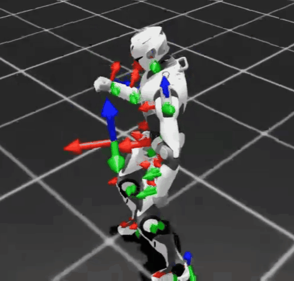
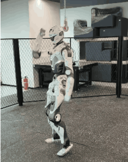
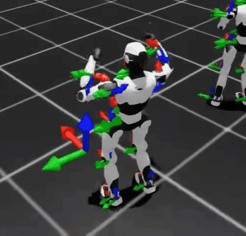
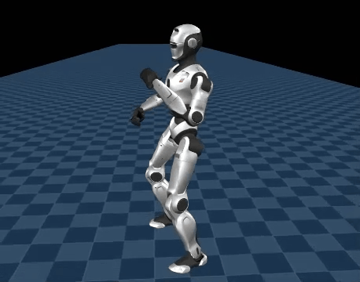
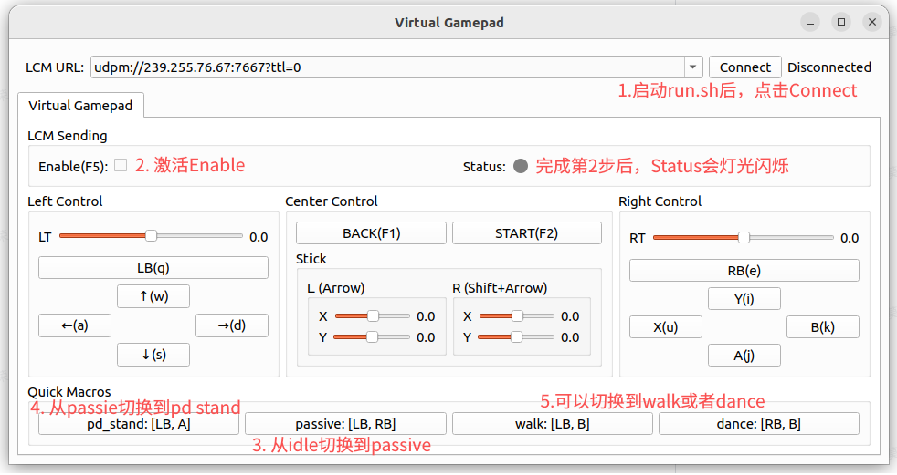

# engineai_rl_lab
[](https://docs.omniverse.nvidia.com/isaacsim/latest/overview.html)
[](https://isaac-sim.github.io/IsaacLab)

[中文](README.md)

## Overview
This project provides a set of reinforcement learning environments based on Isaac Lab. It currently supports EngineAI PM01 and T800 robots, with implemented tasks including whole-body tracking.

|Robot|Training| Sim2Sim |Deploy|
|:--------:|:--------:|:--------:|:--------:|
|||**whole body tracking**|||
|**T800**||||
|**PM01**||||

## Installation
### Install Isaac Lab
This repository is developed based on Isaac Lab 2.3.2, commit `c22775241e28f465fe345fa1a482ad6d29d712b0`. Code may not be compatible across different Isaac Lab versions. For detailed Isaac Lab installation steps, please refer to the official [Isaac Lab installation guide](https://isaac-sim.github.io/IsaacLab/main/source/setup/installation/index.html).

### Install engineai_rl_lab
1. Clone engineai_rl_lab from GitHub:
```bash
git clone https://github.com/engineai-robotics/engineai_rl_lab.git
```

2. Install engineai_rl_lab:
```bash
# Make sure the Isaac Lab environment has been activated.
cd engineai_rl_lab
pip install -e source/engineai_rl_lab
```

## Training
### Whole-Body Tracking
1. Convert CSV files to NPZ files:
```bash
# Convert CSV files to NPZ files. The generated NPZ files are saved in the same directory.
python scripts/csv_to_npz.py --robot pm01 --input_fps 30 -f datasets/tracking/pm01/dance.csv
python scripts/csv_to_npz.py --robot t800 --input_fps 30 -f datasets/tracking/t800/dance.csv

# Replay NPZ files.
python scripts/replay_npz.py --robot pm01 --input_file datasets/tracking/pm01/dance.npz
python scripts/replay_npz.py --robot t800 --input_file datasets/tracking/t800/dance.npz
```

2. Train:
```bash
# PM01
python scripts/tracking/train.py --task Tracking-Flat-PM01-Wo-State-Estimation-v0 --headless --num_envs 4096 --motion_file datasets/tracking/pm01/dance.npz

# T800
python scripts/tracking/train.py --task Tracking-Flat-T800-Wo-State-Estimation-v0 --headless --num_envs 4096 --motion_file datasets/tracking/t800/dance.npz

# View training logs.
python -m tensorboard.main --logdir logs
```

3. Evaluate the trained policy and export it:
```bash
# PM01
python scripts/tracking/play.py --task Tracking-Flat-PM01-Wo-State-Estimation-v0 --num_envs 1 --motion_file datasets/tracking/pm01/dance.npz --load_run 2026-06-23_09-58-43 --checkpoint dance.pt

# T800
python scripts/tracking/play.py --task Tracking-Flat-T800-Wo-State-Estimation-v0 --num_envs 1 --motion_file datasets/tracking/t800/dance.npz --load_run 2026-06-22_22-57-14 --checkpoint dance.pt
```

## Deployment
### Install engineai_robotics_native_sdk
Both simulation deployment and real-robot deployment depend on `engineai_robotics_native_sdk`. For installation instructions, please refer to [engineai_robotics_native_sdk](https://github.com/engineai-robotics/engineai_robotics_native_sdk).

### Sim2Sim
#### Whole-Body Tracking
1. Prepare the data:
- Copy `logs/rsl_rl/xx_flat/xxxx-xx-xx/exported/policy.mnn` to the `assets/config/xxx/rl_dance_example/policies` directory.
- Copy the NPZ motion file to the `assets/config/xxx/rl_dance_example/trajectories` directory.
- Edit `policy_file` and `trajectory_file_npz` in `assets/config/xxx/rl_dance_example/default.yaml`.

> Please make sure that the robot joint positions in the first and last frames of the motion data are basically consistent with those in PD stand. This helps ensure smooth motion when switching policies or modes.

2. Run the simulation:
```bash
# Terminal 1: run the MuJoCo simulation environment.
# Enter the container.
engineai_robotics_env
./scripts/run_mujoco.sh pm01_edu
# ./scripts/run_mujoco.sh t800

# Terminal 2: run the controller.
# Enter the container.
engineai_robotics_env
./run.sh pm01_edu
# ./run.sh t800

# Terminal 3: start the virtual gamepad or use a remote controller.
# Enter the container first, then start the Python program.
engineai_robotics_env
python3 tools/virtual_gamepad/virtual_gamepad.py
```



For remote controller key mappings, please refer to [engineai_robotics_native_sdk](https://github.com/engineai-robotics/engineai_robotics_native_sdk).

> After entering MuJoCo, the robot will automatically fall down. Switch to PD stand mode to restore the robot joints to the initial positions. This operation is only recommended in simulation. Press Enter on the keyboard to reset the MuJoCo environment and place the robot in a standing state. You can then enter dance mode. After the robot finishes the motion, it will automatically switch to walk mode.

### Sim2Real
#### Whole-Body Tracking
1. Edit the deployment target robot parameters in `install.sh` from [engineai_robotics_native_sdk](https://github.com/engineai-robotics/engineai_robotics_native_sdk):
```bash
remote_user="user"
remote_host="192.168.0.163"
remote_dir="~/projects/engineai_robotics"
```

2. Run the installation:
```bash
# Enter the container.
engineai_robotics_env

# Install.
./install pm01_edu robot
# ./install t800 robot
```

3. Run on the real robot:

> **Safety Notice:**
> - Make sure the area is open and that all people keep a safe distance from the robot.
> - If the robot behaves abnormally, stop it immediately by pressing the emergency stop button or switching back to `passive` mode.
> - It is recommended to suspend the robot with a support frame first, enter `pd_stand` mode, place it on the ground, and then switch to walking mode.

**Preparation Before Running:**
- Enable the robot motor system using the emergency stop button for PM01 or the remote controller for T800.
- Connect to the robot hotspot.

**Startup Steps:**
```bash
# 1. SSH into the robot (Nezha).
ssh user@192.168.0.163

# 2. Stop the auto-started motion-control program; otherwise native_sdk cannot be started.
sudo systemctl stop robotics.service

# 3. Start native_sdk. Make sure the motor system has been enabled.
cd ~/projects/engineai_robotics
sudo ./run_robot.sh pm01_edu
# sudo ./run_robot.sh t800

# 4. Use the remote controller to switch modes and enter dance mode.
```

## TODO
- [ ] Add AMP humanoid walking.
- [ ] Add walking training based on Direct RL Environment.
- [ ] Improve documentation and tutorials.

## Technical Support
If you encounter any issues while using this project, please submit an issue in this project's GitHub repository and we will reply as soon as possible. 

## License
This project is open-sourced under the **BSD 3-Clause License**. See the [LICENSE](LICENSE.txt) file for details.

## Acknowledgements
This project benefits from the support and contributions of the following open-source projects. We sincerely thank them:

- **[IsaacLab](https://github.com/isaac-sim/IsaacLab)** - The base framework for training and running simulation experiments.
- **[rsl_rl](https://github.com/leggedrobotics/rsl_rl)** - A high-performance reinforcement learning library for legged robots.
- **[BeyondMimic](https://github.com/HybridRobotics/whole_body_tracking)** - Inspiration for the project structure and reference implementation of valuable features.
- **[MNN](https://github.com/alibaba/mnn)** - A lightweight, high-performance inference engine for edge deployment.
